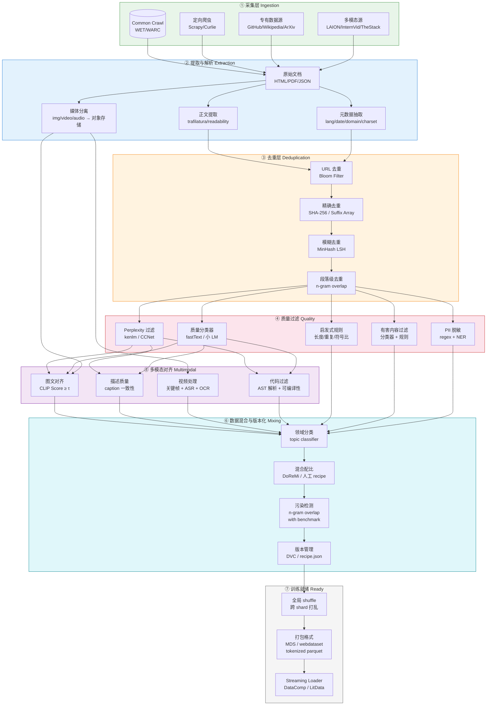

# 大模型训练数据全链路 Pipeline

## 端到端总览

---

## 各阶段详细标注

### ① 采集层 Ingestion

| 数据源 | 输入 | 输出 | 关键方法 | 注意事项 |
|--------|------|------|---------|---------|
| Common Crawl | WARC/WET 文件 (月度快照, ~60TB/月) | 原始 HTML 纯文本 | `aws s3 cp s3://commoncrawl/...`; CCNet pipeline 预处理 | WARC 含 HTTP 头，WET 是提取后纯文本；优先用 WET |
| 定向爬虫 | 目标站点 URL 列表 | HTML/JSON 原始页面 | Scrapy + Playwright; robots.txt 合规检查; 增量爬取 (If-Modified-Since) | 频率控制、IP 轮换、UA 伪装；合规优先 |
| 专有数据源 | GitHub API / Wikipedia dump / ArXiv bulk | 代码文件 / Wiki 正文 / 论文 PDF/TeX | GitHub Archive BigQuery; wikiextractor; Grobid (PDF→结构化) | GitHub 需过滤 license; ArXiv 需 LaTeX→text |
| 多模态源 | LAION / InternVid / The-Stack | 图文对 / 视频元信息 / 代码文件 | img2dataset (URL→本地); yt-dlp (视频下载) | URL 失效率高 (LAION ~30% dead), 需验证可达性 |

### ② 提取与解析 Extraction

| 步骤 | 输入 | 输出 | 关键方法 | 注意事项 |
|------|------|------|---------|---------|
| 正文提取 | HTML 页面 | 纯文本 + 结构标记 | trafilatura (主); readability-lxml (备); jusText (段落级) | 保留 `<code>`, `<table>` 等语义标签；丢弃 nav/footer/ad |
| 元数据抽取 | HTML/text | lang, date, domain, title, charset | fastText lid.176 (语言); date-regex; tldextract | 语言检测是后续过滤的基础；charset 错误导致乱码 |
| 媒体分离 | HTML 中的 `/<video>/<audio>` | 独立媒体文件 + 关联文本 | img2dataset; ffmpeg (视频转帧); whisper (ASR) | 媒体存对象存储，文本存列式格式，保持引用关系 |

### ③ 去重层 Deduplication

| 步骤 | 输入 | 输出 | 关键方法 | 复杂度 | 注意事项 |
|------|------|------|---------|--------|---------|
| URL 去重 | 全量文档 | 去重后文档 (URL 唯一) | Bloom Filter (FPR ~0.01); URL normalize (去参数/fragment) | O(n) | 同一内容多 URL 的情况无法捕获 |
| 精确去重 | URL 唯一文档 | 内容唯一文档 | SHA-256 hash; Suffix Array (子串级) | O(n) → O(n log²n) | Suffix Array 可检测抄袭/镜像站的大段重复 |
| 模糊去重 | 精确去重后文档 | 近似唯一文档 | MinHash (128 perm) + LSH (Jaccard ≥ 0.8) | O(n) 近似 | CCNet 标准配置; 保留 cluster 中心，丢弃其余 |
| 段落级去重 | 近似唯一文档 | 段落唯一文档 | 50-gram overlap; n-gram hash | O(n) | 防止同一段落出现在不同文档中污染训练 |

**去重顺序很重要**：URL → 精确 → 模糊 → 段落，每步减少下一步的计算量。

### ④ 质量过滤 Quality

| 步骤 | 输入 | 输出 | 关键方法 | 成本 | 注意事项 |
|------|------|------|---------|------|---------|
| Perplexity 过滤 | 去重后文档 | 低困惑度文档 (更自然) | kenlm 5-gram LM; CCNet 标准: 保留 PPL 最低的 70% | 低 (CPU) | PPL 高 ≠ 低质 (诗歌/代码 PPL 天然高); 需按语言/领域分别建模 |
| 质量分类器 | 低困惑度文档 | 高质量文档子集 | fastText supervised (GPT-3 分类器范式); 或小 LM (如 1.3B) 打分 | 中 | 训练数据: Wikipedia + Books = 正例; 随机 Common Crawl = 负例 |
| PII 脱敏 | 高质量文档 | 脱敏文档 | regex (邮箱/手机/SSN); Presidio (NER-based) | 低 | 需平衡隐私与语料完整性; 过度脱敏破坏语义 |
| 有害内容过滤 | 脱敏文档 | 安全文档 | 分类器 (ToxiGen); 关键词黑名单 | 低 | 需多语言支持; 误杀率需监控 |
| 启发式规则 | 安全文档 | 规则通过文档 | 重复 n-gram 比例 < 阈值; 符号/数字占比; 行长度分布; 最短/最长阈值 | 极低 | 阈值需按语言/领域调; 代码和散文规则不同 |

**级联顺序**：PPL → 分类器 → PII → 有害 → 启发式。先低成本过滤，再高成本精筛。

### ⑤ 多模态对齐 Multimodal

| 模态 | 输入 | 输出 | 关键方法 | 阈值参考 |
|------|------|------|---------|---------|
| 图文对 | (image, caption) | 高对齐度图文对 | CLIP ViT-L/14 score; CLIP_similarity ≥ 0.28 (LAION 过滤标准) | 0.28–0.33 因数据集而异 |
| 描述质量 | (image, caption) | 高质量描述 | caption 长度 ≥ 5 words; 无重复句; 与 image 语义一致 (反向生成验证) | 过短/模板化 caption 需过滤 |
| 视频 | 原始视频 | (关键帧序列, ASR 文本, OCR 文本) | PySceneDetect (场景切分); Whisper (ASR); PaddleOCR; 均匀采样 1fps 作 fallback | 视频需去水印、去片头片尾 |
| 代码 | 源代码文件 | 可解析/可编译代码 | tree-sitter AST 解析; 编译测试 (go build, pytest --collect); 仓库级去重 | 保留有测试的代码; 过滤 auto-generated |

### ⑥ 数据混合与版本化 Mixing

| 步骤 | 输入 | 输出 | 关键方法 | 注意事项 |
|------|------|------|---------|---------|
| 领域分类 | 各质量等级文档 | 带领域标签文档 | fastText topic classifier; 预定义领域: web/books/code/wiki/science/multimodal | 分类器需覆盖训练目标领域 |
| 混合配比 | 带标签文档 | 最终训练集 | DoReMi (动态权重优化); 人工 recipe (Llama 式); 课程学习 (先通用后专业) | 配比是核心超参数; 需消融实验验证 |
| 污染检测 | 最终训练集 + benchmark | 去污染训练集 | 13-gram overlap with MMLU/HumanEval 等; 困惑度检测 | 污染导致评估虚高; 需在训练前完成 |
| 版本管理 | recipe + 数据指纹 | 可复现快照 | recipe.json (数据源+比例+过滤阈值); DVC / LakeFS; 数据卡片 (DataCard) | 每次训练绑定 recipe 版本; 支持 diff 两个版本 |

### ⑦ 训练就绪 Ready

| 步骤 | 输入 | 输出 | 关键方法 | 注意事项 |
|------|------|------|---------|---------|
| 全局 Shuffle | 版本化数据集 | 打乱后 shard | 跨 shard 采样; reservoir sampling | 避免 epoch boundary 效应; 保持跨领域均匀 |
| 打包格式 | 打乱后文档 | tokenized shard | MDS (Mosaic); webdataset (.tar); tokenized parquet + Arrow | 格式选择取决于训练框架; streaming 优先 |
| Streaming Loader | tokenized shard | 训练 batch | LitData; DataComp streaming; HuggingFace IterableDataset | 零本地存储; 支持断点续训; 预取 + 缓冲 |

---

## 关键指标速查

| 指标 | 典型值 | 说明 |
|------|--------|------|
| Common Crawl 原始 → 清洗后保留率 | 15%–25% | 大部分网页是低质/重复/垃圾 |
| MinHash 去重率 | 30%–50% | 互联网重复内容极多 |
| 质量分类器通过率 | 40%–70% | 取决于正负例定义 |
| 图文对 CLIP 过滤保留率 | 30%–60% | LAION 原始 URL 失效 + 低质量 |
| 端到端保留率 (原始 → 训练就绪) | 5%–15% | 每层过滤的累积效果 |
| PB 级处理成本 (AWS) | ~$50K–$150K | 取决于质量等级和算力选择 |

---

## 架构选型速查

| 场景 | 推荐 | 理由 |
|------|------|------|
| 批量文本清洗 (TB–PB) | Spark + MinHash LSH | 成熟生态; shuffle 优化好; CPU 密集型 |
| 推理密集型过滤 (CLIP/分类器) | Ray Data + GPU 集群 | 动态调度; GPU 异构; 低延迟 |
| 多模态数据存储 | Lance 格式 + S3 | 列式 + 向量索引; 随机访问; 零拷贝 |
| 结构化文本存储 | Parquet + Hive Metastore | 生态成熟; 谓词下推; 列裁剪 |
| 进程间数据交换 | Arrow IPC | 零拷贝; 跨语言; 无序列化开销 |
| 数据版本管理 | DVC + recipe.json | Git-like; 轻量; 与训练框架解耦 |
